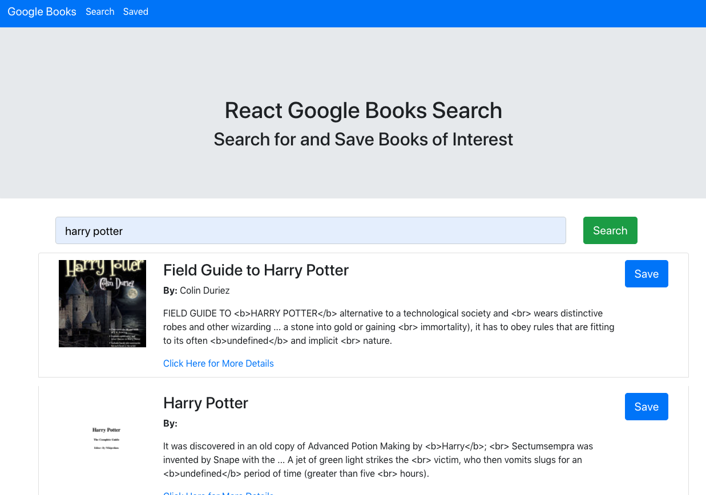

# react-book-search
This application is built using react and it allows the user to search the google books API and view results for interesting books. This app was created for the MERN stack lesson, which is the 21st a final chapter in the JHU Fullstack Bookcamp.

# Developer Story
I am happy that I was able to get this app running. I took a few phases of troubleshooting to get it completed. I started by creating the all the compononets I would need and then setting up the search page and the saved page. Next I set up the app.js using React Router to render the pages in the appropriate paths. After that I worked on figuring out the API call to the google books API and getting the response to render the results onto the search page and then allow the user to click the save button to add the file to the db. I ran into a roadblock when the save button kept throwing an error, I went over the code with my tutor and then later reached out to my TA to see to if we could determine the cause. Even with the extra sets of eyes we could not locate the problem. I let it sit for a couple days while I worked of my other project, and then I did another review and I was able to locate the source of the issue. I had set up the db schema with "description" and I was attempting to pass save into it as "descriptions"(classic example of debugging). After fixing that line, everything preformed as expected, I changed the db connection to work on heroku and just like that... my days of doing homeworks this the coding bootcamp and JHU were over. 

## Key Topics
* React Router
* Lifecycle methods
* MERN 
* Proxy
* AJAX calls

## Screenshot

## Link 
<a href="https://react-book-search-zen.herokuapp.com/" target="_blank"> Click Here to View </a>

## acknowledgments
Big thanks to everyone who helped me out on this project and throughout the  bootcamp, I know that I have had at least one positive interaction every single person in the cohort at some point. Our instructor Steteson and TA Donald did a great job the whole time. I also apreciated Gemini's contribution as Student Success Manager. I make it thought the first section of the class with a lot of help from my intial study group memebers Keisha and Tina. In the second half of class I got a lot of help from my fellow classmate Colin, our mutual interest in pop punk banks like blink-182 and New Found Glory empowered us to work well together. I plan to collaborate with him on professional work after the class in over. This concludes my thank you section and general remarks...readme over.  

